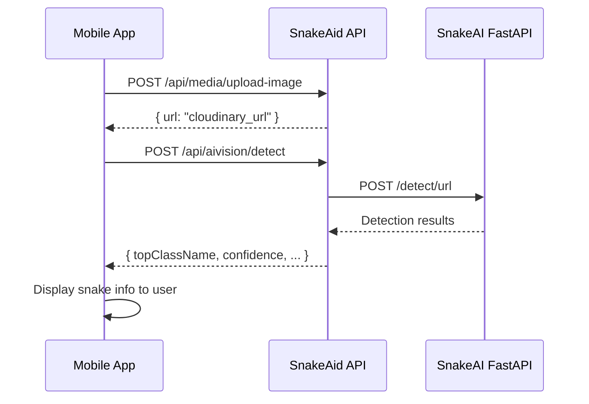

# AI Vision Detection - Usage Guide

> **Endpoint:** `POST /api/aivision/detect`  
> **Auth:** Bearer Token required

---

## Quick Start

### Request

```http
POST /api/aivision/detect
Content-Type: application/json
Authorization: Bearer {your_token}

{
  "imageUrl": "https://res.cloudinary.com/snakeaid/image/upload/v123/snake.jpg",
  "confidence": 0.25
}
```

### Response

```json
{
  "modelVersion": "snake-yolo12-v1.0",
  "imageWidth": 640,
  "imageHeight": 480,
  "topClassName": "naja_kaouthia",
  "topConfidence": 0.89,
  "detectionCount": 1,
  "detections": [
    {
      "classId": 5,
      "className": "naja_kaouthia",
      "confidence": 0.89,
      "bbox": { "x1": 100, "y1": 50, "x2": 400, "y2": 350 }
    }
  ],
  "warnings": {
    "blur": 0.1,
    "brightness": 0.5,
    "tooSmall": 0.0
  }
}
```

---

## Parameters

| Field | Type | Required | Default | Description |
|-------|------|----------|---------|-------------|
| `imageUrl` | string | ✅ | - | Public image URL (Cloudinary preferred) |
| `confidence` | float | ❌ | 0.25 | Min confidence threshold (0.0-1.0) |

---

## Code Examples

### JavaScript/TypeScript

```typescript
const detectSnake = async (imageUrl: string) => {
  const response = await fetch('/api/aivision/detect', {
    method: 'POST',
    headers: {
      'Content-Type': 'application/json',
      'Authorization': `Bearer ${token}`
    },
    body: JSON.stringify({ imageUrl, confidence: 0.3 })
  });

  if (!response.ok) {
    if (response.status === 503) {
      throw new Error('AI service unavailable');
    }
    throw new Error('Detection failed');
  }

  return response.json();
};
```

### Dart/Flutter

```dart
Future<AIVisionResult> detectSnake(String imageUrl) async {
  final response = await http.post(
    Uri.parse('$baseUrl/api/aivision/detect'),
    headers: {
      'Content-Type': 'application/json',
      'Authorization': 'Bearer $token',
    },
    body: jsonEncode({
      'imageUrl': imageUrl,
      'confidence': 0.25,
    }),
  );

  if (response.statusCode == 503) {
    throw AIServiceUnavailableException();
  }

  if (response.statusCode != 200) {
    throw DetectionFailedException();
  }

  return AIVisionResult.fromJson(jsonDecode(response.body));
}
```

---

## Error Handling

| Status | Error | Description |
|--------|-------|-------------|
| 400 | `ImageUrl is required` | Missing imageUrl field |
| 401 | `Unauthorized` | Missing or invalid token |
| 503 | `AI Service Unavailable` | SnakeAI FastAPI down |
| 500 | `Detection Failed` | Processing error |

### Error Response Format

```json
{
  "error": "AI Service Unavailable",
  "message": "Snake detection service is currently unavailable. Please try again later."
}
```

---

## Typical Flow



---

## Best Practices

1. **Upload first** - Always upload to Cloudinary before calling detect
2. **Handle 503** - Show "service unavailable" UI, retry after 30s
3. **Check confidence** - Show warning if `topConfidence < 0.5`
4. **Check warnings** - Alert user if `blur > 0.5` (blurry image)
5. **Cache results** - Store detection results with reportMediaId

---

## Related Endpoints

| Endpoint | Method | Description |
|----------|--------|-------------|
| `/api/media/upload-image` | POST | Upload image to Cloudinary |
| `/api/snake-library/{classId}` | GET | Get snake info by YOLO class |
