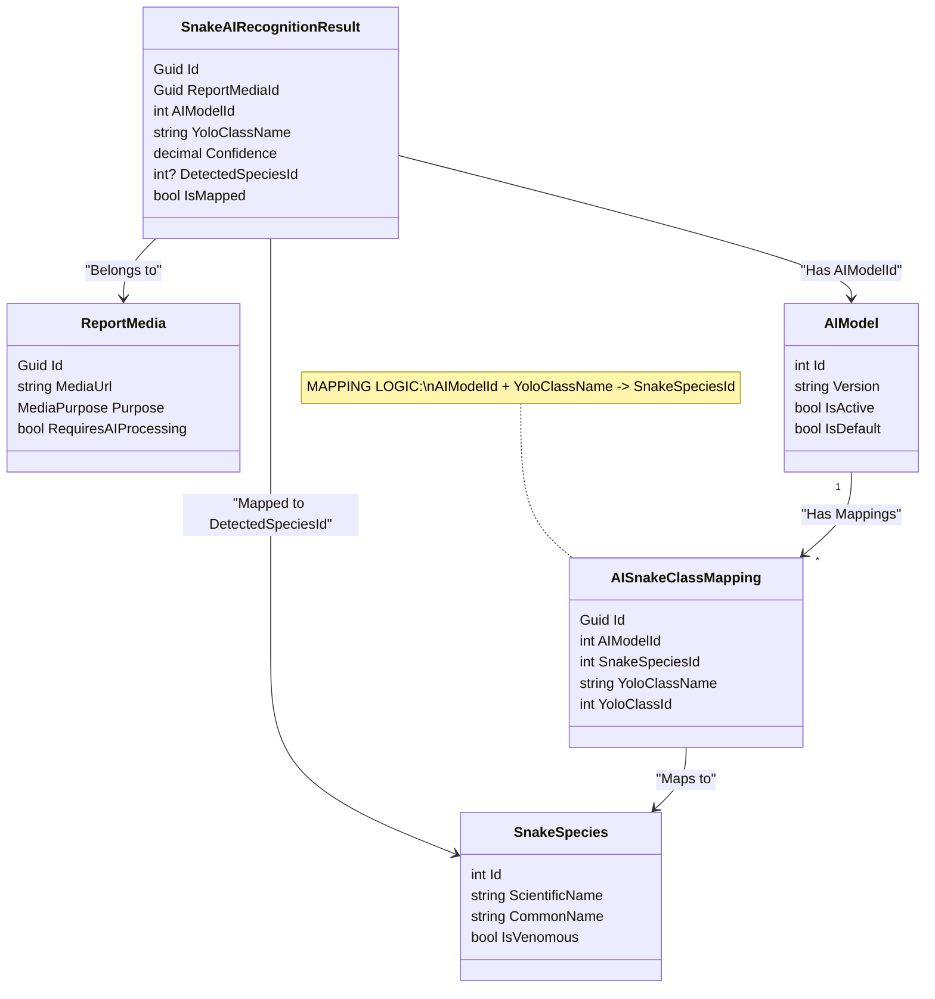

# Snake Detection Phase 2 - Integration with SnakeLibs

## 1. Overview
Giai đoạn 2 tập trung vào việc tích hợp kết quả nhận diện từ AI (YOLO) với cơ sở dữ liệu loài rắn (SnakeLibs) của hệ thống.
Mục tiêu là lưu trữ lịch sử nhận diện và trả về thông tin chi tiết của loài rắn (tên khoa học, độ độc, ...) thay vì chỉ trả về nhãn raw từ mô hình AI.


## 2. Endpoint Overview (Two-Step Flow)

Quy trình nhận diện sẽ tuân thủ nguyên tắc: **Upload Media & Create Entity trước -> Detect sau**. Điều này đảm bảo mọi kết quả nhận diện đều gắn liền với một `ReportMedia` hợp lệ trong hệ thống.

### Step 1: Upload Media (Tạo Entity)

Endpoint mới chuyên dụng để upload ảnh cho các báo cáo/nghiệp vụ.

- **URL:** `POST /api/media/report`
- **Content-Type:** `multipart/form-data`
- **Query Params:**
    - `Type` (MediaReferenceType): `CommunityReport`, `SnakebiteIncident`, etc.
    - `Purpose` (MediaPurpose): `SnakeIdentification` (Default: `SnakeIdentification`).
- **Form Data (Body):**
    - `File`: (Binary) File ảnh/video.
    - `ReferenceId` (Guid): ID của Parent Entity (IncidentId, ReportId...) **[REQUIRED]**.
- **Flow:**
    1.  Validate file & permission.
    2.  Upload Cloudinary -> Get URL.
    3.  Lưu bảng `ReportMedia` với `ReferenceId` và `ReferenceType`.
    4.  Return `ReportMedia` object (bao gồm `Id` và `MediaUrl`).

### Step 2: Detect Snake (Nhận diện)

Endpoint nhận diện giờ đây sẽ làm việc với `ReportMediaId` thay vì URL trần.

- **URL:** `POST /api/detection/detect`
- **Params:** `ReportMediaId` (Guid)
- **Flow:**
    1.  Health Check: Gọi `_snakeAIService.IsHealthyAsync()`.
    2.  Validate `ReportMediaId` tồn tại.
    3.  Gọi AI Service với URL của Media đó.
    4.  Lưu `SnakeAIRecognitionResult` tham chiếu tới `ReportMediaId`.
    5.  Return kết quả nhận diện + thông tin loài.

---

## 3. Entity Graph & Data Model

Hệ thống sử dụng các entity sau để mapping và lưu trữ kết quả:



### Chi tiết Entities:

1.  **`ReportMedia`**:
    *   Lưu trữ thông tin file ảnh/video upload (URL từ Cloudinary).
    *   Được liên kết với các nghiệp vụ khác (Community Report, SOS, Rescue).
    *   Trường `RequiresAIProcessing` cờ đánh dấu cần gọi AI.

2.  **`SnakeAIRecognitionResult`**:
    *   Lưu trữ kết quả mỗi lần request (Audit/History).
    *   FK `ReportMediaId`: Liên kết 1-n (một ảnh có thể chạy AI nhiều lần hoặc nhiều model khác nhau).
    *   Có trường `DetectedSpeciesId` là kết quả sau khi map.

3.  **`AIModel`**:
    *   Định danh phiên bản model đang chạy (VD: `snake-yolo12-v1.0`).
    *   Cần thiết để chọn đúng bộ mapping (vì các version model có thể có bộ class khác nhau).

4.  **`AISnakeClassMapping`**:
    *   Bảng tra cứu: `(AIModelId, YoloClassName) => SnakeSpeciesId`.
    *   Cho phép decouple việc huấn luyện AI và quản lý dữ liệu loài trong DB.

## 3. Updated Architecture Loop

```
[Client] -> [API: SnakeDetectionController]
                 |
                 v
            [SnakeAIService] -> [SnakeAI FastAPI] -> (1) Get YOLO Result
                 |
                 v
            [Service Logic]
                 |--> (2) Get Active AIModel (Cacheable)
                 |--> (3) Mapping: Find AISnakeClassMapping (ModelId + ClassName)
                 |--> (4) Enrich: Get SnakeSpecies info
                 |--> (5) Persist: Save SnakeAIRecognitionResult to DB
                 |
                 v
            [Client Response] (Includes Species Info + Risk Level)
```

## 4. Implementation Steps

### Step 1: Repositories & Database Access
Hiện tại dự án sử dụng `GenericRepository`. Cần inject `IUnitOfWork` hoặc các Repository `IGenericRepository<T>` cần thiết vào `SnakeAIService`:
- `IGenericRepository<AIModel>`
- `IGenericRepository<AISnakeClassMapping>`
- `IGenericRepository<SnakeAIRecognitionResult>`
- `IGenericRepository<SnakeSpecies>`

### Step 2: Update `SnakeAIService`
Cập nhật method `DetectAsync` để thực hiện full flow:
1.  **Call AI**: Giữ nguyên logic gọi Refit Client.
2.  **Validation**: Kiểm tra kết quả trả về.
3.  **Mapping Flow**:
    *   Lấy `ModelVersion` từ AI Response.
    *   Tìm `AIModel` trong DB khớp version.
    *   Tìm `AISnakeClassMapping` khớp `AIModel.Id` và `YoloClassName`.
    *   Nếu có mapping -> set `DetectedSpeciesId` và `IsMapped = true`.
4.  **Persist**: Tạo và lưu `SnakeAIRecognitionResult`.
5.  **Enrich Response**:
    *   Cập nhật `SnakeDetectionResponse` để trả về thêm `SpeciesId`, `ScientificName`, `RiskLevel` cho Frontend hiển thị cảnh báo.

### Step 3: DTO Updates
Cập nhật `SnakeDetectionResponse.cs` và `SnakeAIDetection.cs` để thêm các trường thông tin loài rắn.

```csharp
public class SnakeAIDetection
{
    // Existing fields...
    public int? SpeciesId { get; set; }
    public string? SpeciesName { get; set; }        // Tên thường gọi (VN) - Display on UI
    public string? ScientificName { get; set; }     // Tên khoa học - Display on UI
    public bool? IsVenomous { get; set; }           // Cờ xác định rắn độc - Trigger Red Banner/Alert
    public float? RiskLevel { get; set; }           // Mức độ nguy hiểm (0-10) - Display Bar Chart
}
```

## 5. Timeline Estimate
- **Repository Setup**: 30 mins
- **Mapping Logic Implementation**: 1.5 hours
- **Response Enrichment**: 30 mins
- **Testing (Integration)**: 1 hour