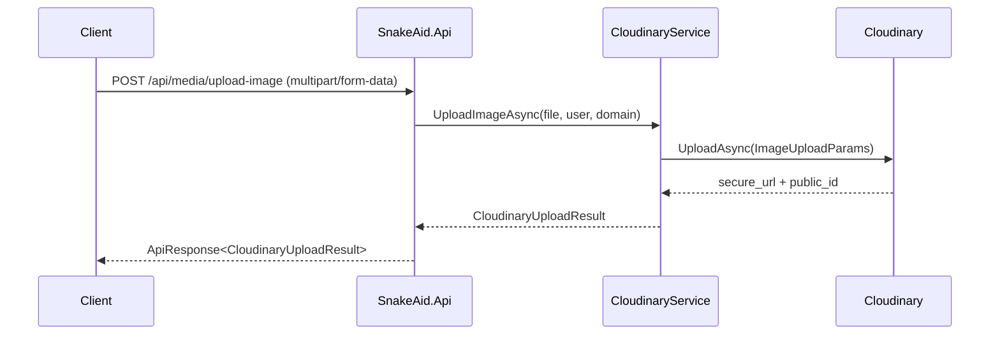

# Cloudinary Integration - Source Code Documentation

This document describes the intended source code structure after Cloudinary integration is implemented in SnakeAid. It is written to minimize future code crawling by capturing the key method signatures, flows, and configuration contracts in one place.

## Status
As of 2026-01-27, the Cloudinary foundation (Phase A) is implemented:
- Settings: `SnakeAid.Core/Settings/CloudinarySettings.cs`
- Contracts: `SnakeAid.Core/Requests/Media/UploadImageRequest.cs`
- Contracts: `SnakeAid.Core/Requests/Media/UploadFileRequest.cs`
- Contracts: `SnakeAid.Core/Responses/Media/CloudinaryUploadResult.cs`
- Service: `SnakeAid.Service/Interfaces/ICloudinaryService.cs`
- Service: `SnakeAid.Service/Implements/CloudinaryService.cs`
- API: `SnakeAid.Api/Controllers/MediaController.cs`
- API: `SnakeAid.Api/DI/DependencyInjection.cs`
- API: `SnakeAid.Api/Program.cs`
- API: `SnakeAid.Api/appsettings.Example.json`

## Scope for This Turn (Cloudinary-Centric)
- Document the Cloudinary foundation only.
- Do not include database persistence such as `ReportMedia` in this turn.
- Keep contracts and folder conventions ready for future persistence phases.

## Configuration

### Cloudinary Settings Class
**Location**: `SnakeAid.Core/Settings/CloudinarySettings.cs`

```csharp
namespace SnakeAid.Core.Settings;

public class CloudinarySettings
{
    public string CloudName { get; set; } = string.Empty;
    public string ApiKey { get; set; } = string.Empty;
    public string ApiSecret { get; set; } = string.Empty;
    public string BaseFolder { get; set; } = "snakeaid";
}
```

### DI Binding and Validation
**Location**: `SnakeAid.Api/DI/DependencyInjection.cs`

`AddServices` now accepts `IConfiguration`:

```csharp
public static IServiceCollection AddServices(this IServiceCollection services, IConfiguration configuration)
```

Inside `AddServices(IServiceCollection services, IConfiguration configuration)`:

```csharp
var cloudinarySection = configuration.GetSection("Cloudinary");
services.Configure<CloudinarySettings>(cloudinarySection);

if (cloudinarySection.Exists())
{
    var cloudinarySettings = cloudinarySection.Get<CloudinarySettings>();
    if (cloudinarySettings is null ||
        string.IsNullOrWhiteSpace(cloudinarySettings.CloudName) ||
        string.IsNullOrWhiteSpace(cloudinarySettings.ApiKey) ||
        string.IsNullOrWhiteSpace(cloudinarySettings.ApiSecret))
    {
        throw new InvalidOperationException("Cloudinary settings are not configured properly.");
    }
}
```

`Program.cs` now passes configuration into DI:

```csharp
builder.Services.AddServices(builder.Configuration);
```

## Service Layer

### ICloudinaryService
**Location**: `SnakeAid.Service/Interfaces/ICloudinaryService.cs`

```csharp
using System.Security.Claims;
using SnakeAid.Core.Responses.Media;

namespace SnakeAid.Service.Interfaces;

public interface ICloudinaryService
{
    Task<CloudinaryUploadResult> UploadImageAsync(
        IFormFile file,
        ClaimsPrincipal user,
        string domain,
        CancellationToken cancellationToken = default);

    Task<CloudinaryUploadResult> UploadFileAsync(
        IFormFile file,
        ClaimsPrincipal user,
        string domain,
        CancellationToken cancellationToken = default);
}
```

### CloudinaryUploadResult
**Location**: `SnakeAid.Core/Responses/Media/CloudinaryUploadResult.cs`

```csharp
namespace SnakeAid.Core.Responses.Media;

public class CloudinaryUploadResult
{
    public string SecureUrl { get; set; } = string.Empty;
    public string PublicId { get; set; } = string.Empty;
    public string ResourceType { get; set; } = string.Empty;
    public string? Format { get; set; }
    public long? Bytes { get; set; }
    public int? Width { get; set; }
    public int? Height { get; set; }
    public string Folder { get; set; } = string.Empty;
    public IReadOnlyCollection<string> Tags { get; set; } = Array.Empty<string>();
}
```

### CloudinaryService
**Location**: `SnakeAid.Service/Implements/CloudinaryService.cs`

#### Constructor Flow
1. Load `CloudinarySettings`.
2. Validate required fields.
3. Create the Cloudinary `Account` and `Cloudinary` client.
4. Cache allowed extensions and size limits.

Constructor signature:
```csharp
public CloudinaryService(
    IOptions<CloudinarySettings> options,
    IHostEnvironment env,
    ILogger<CloudinaryService> logger)
```

#### UploadImageAsync Flow
High-level steps:
1. Validate input file.
2. Extract user ID from `ClaimTypes.NameIdentifier`.
3. Build folder: `{BaseFolder}/{EnvironmentName}/{domain}/{userId}`.
4. Build public ID from sanitized file name plus timestamp.
5. Upload using `ImageUploadParams` with non-destructive transformation.
6. Validate `SecureUrl`.
7. Map SDK result to `CloudinaryUploadResult`.

Recommended transformation:
```csharp
new Transformation()
    .Width(1600)
    .Crop("limit")
    .Quality("auto")
    .FetchFormat("auto");
```

#### UploadFileAsync Flow
High-level steps:
1. Validate input file and size.
2. Extract user ID.
3. Build folder and public ID.
4. Upload using `AutoUploadParams`.
5. Validate `SecureUrl`.
6. Map to `CloudinaryUploadResult`.

#### Error Handling Strategy
Prefer throwing `ApiException` types:
- `ValidationException` for type and size issues.
- `UnauthorizedException` for missing or invalid user claims.
- `BadRequestException` for Cloudinary errors or missing URLs.

This aligns with `SnakeAid.Core/Middlewares/ApiExceptionHandlerMiddleware.cs`.

## API Layer

### Upload Requests
**Locations**:
- `SnakeAid.Core/Requests/Media/UploadImageRequest.cs`
- `SnakeAid.Core/Requests/Media/UploadFileRequest.cs`

Minimal request shapes:
```csharp
public class UploadImageRequest
{
    public IFormFile File { get; set; } = default!;
    public string Domain { get; set; } = "uploads";
}

public class UploadFileRequest
{
    public IFormFile File { get; set; } = default!;
    public string Domain { get; set; } = "files";
}
```

### MediaController
**Location**: `SnakeAid.Api/Controllers/MediaController.cs`

Controller signature:
```csharp
[ApiController]
[Authorize]
[Route("api/media")]
public class MediaController : BaseController<MediaController>
```

Endpoint summary:
- `POST /api/media/upload-image`
- `POST /api/media/upload-file`

Endpoint flow:
1. Validate multipart request.
2. Call `ICloudinaryService`.
3. Return `ApiResponse<T>` via `ApiResponseBuilder.BuildSuccessResponse`.

## Future Plan - Persistence (Deferred)
Persistence, including `ReportMedia`, is intentionally deferred in this turn to minimize risk and keep the implementation Cloudinary-centric.

## End-to-End Upload Flow



## Future Plan - Potential Domain Consumers
The following domains are expected to consume Cloudinary URLs in later phases:
- `SnakeAid.Core/Domains/ReportMedia.cs`
- `SnakeAid.Core/Domains/LibraryMedia.cs`
- `SnakeAid.Core/Domains/Account.cs`
- `SnakeAid.Core/Domains/ExpertCertificate.cs`
- `SnakeAid.Core/Domains/ChatMessage.cs`
- `SnakeAid.Core/Domains/FilterOption.cs`

## Notes on Deletion and Cleanup
Current domain models do not store Cloudinary `PublicId`. If deletion is required later, add `PublicId` fields and a follow-up migration so the backend can delete assets via the Cloudinary API.
