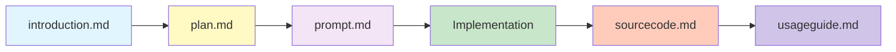
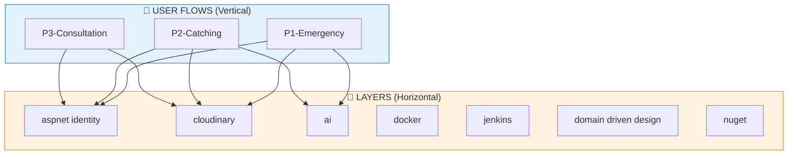

# Documentation Organization Guide

## Folder Structure

Tài liệu được tổ chức theo **2 chiều**:

| Dimension | Folder | Mô tả |
|-----------|--------|-------|
| **Vertical** | `01-flows/` | User journeys - theo flow nghiệp vụ |
| **Horizontal** | `02-layers/` | System layers - lát cắt hạ tầng |

```
docs/
├── README.md                    # File này
├── _sidebar.md                  # Docsify navigation
│
├── 01-flows/                    # 📱 VERTICAL: User Flows
│   ├── _API_Plan.md             # Roadmap tổng hợp tất cả endpoints
│   │
│   ├── P1-emergency/            # Flow P1: Cứu hộ khẩn cấp
│   │   ├── S1-identified/       # SubFlow: Nhận diện được rắn
│   │   │   └── _flow.md         # Các bước trong subflow
│   │   └── S2-not-identified/   # SubFlow: Không nhận điện
│   │
│   └── P2-catching/             # Flow P2: Bắt rắn
│       ├── S1-single-snake/     # SubFlow: Bắt 1 con
│       └── ...
│
└── 02-layers/                   # 🔧 HORIZONTAL: System Layers
    ├── aspnet identity/         # Authentication (ASP.NET Identity)
    ├── cloudinary/              # Media storage (Cloudinary)
    ├── ai/                      # AI services (SnakeAI)
    ├── docker/                  # Docker containerization
    ├── jenkins/                 # CI/CD pipeline
    ├── domain driven design/    # Architecture patterns (DDD)
    └── nuget/                   # Package management (NuGet)
```

---

## Hierarchy Explanation

### Flows (Vertical - 01-flows/)

Tổ chức theo **user journey**, xuyên qua nhiều layer của hệ thống.

```
Flow (P1, P2...)           # Feature chính (Cứu hộ, Bắt rắn...)
  └── SubFlow (S1, S2...)  # Nhánh con trong flow
       └── Screen/Step     # Màn hình / bước cụ thể
            └── Endpoint   # API endpoint (nếu có)
```

**Naming convention:**
| Level | Format | Ví dụ |
|-------|--------|-------|
| Flow | `P{n}-{name}/` | `P1-emergency/` |
| SubFlow | `S{n}-{name}/` | `S1-identified/` |
| Flow overview | `_flow.md` | Liệt kê tất cả screens |

### Layers (Horizontal - 02-layers/)

Tổ chức theo **system infrastructure**, phục vụ xuyên suốt nhiều flows.

| Layer | Mục đích | Ví dụ |
|-------|----------|-------|
| `auth/` | Authentication & Authorization | ASP Identity, JWT |
| `media/` | File & Image storage | Cloudinary |
| `ai/` | AI/ML services | SnakeAI YOLO model |
| `devops/` | CI/CD, Containerization | Docker, Jenkins |
| `architecture/` | Design patterns | Domain Driven Design |
| `packages/` | Dependency management | NuGet |

---

## File Naming Convention

Mỗi hạng mục (trong cả flows và layers) có **5 loại file** theo quy ước:

### 1. `*.introduction.md` - Giới thiệu

**Mục đích**: Giới thiệu chức năng hoặc công nghệ  
**Nguồn**: Thường lấy từ SRS (Software Requirements Specification)  
**Độ chi tiết**: High-level overview  
**Người đọc**: PM, Tech Lead, Developer mới vào dự án

**Nội dung bao gồm**:
- Tổng quan về chức năng/công nghệ
- Lý do sử dụng (Why?)
- Use cases chính
- Lợi ích và trade-offs
- Tham khảo tài liệu gốc

---

### 2. `*.plan.md` - Kế hoạch Implementation

**Mục đích**: Kế hoạch để implement chức năng vào codebase hiện có  
**Thời điểm**: Trước khi bắt đầu coding  
**Độ chi tiết**: Medium-level design  
**Người đọc**: Developer, Tech Lead

**Nội dung bao gồm**:
- Phân tích hiện trạng codebase
- Các thay đổi cần thiết (files to modify/create)
- Dependencies cần thêm
- Migration plan (nếu có)
- Risks và mitigation
- Timeline ước tính

---

### 3. `*.prompt.md` - Prompt cho Agent

**Mục đích**: Prompt để thực hiện thao tác implement  
**Thời điểm**: Ngay trước khi implement (sát với hiện trạng codebase)  
**Độ chi tiết**: Very detailed, actionable  
**Người đọc**: AI Agent (Antigravity, Copilot, etc.)

**Nội dung bao gồm**:
- Yêu cầu cụ thể từng bước
- Code snippets mẫu
- Configuration settings
- Testing requirements
- Expected output

**Đặc điểm**:
- Viết dưới dạng instructions/commands
- Bao gồm tất cả context cần thiết
- Có thể copy-paste trực tiếp cho agent

---

### 4. `*.sourcecode.md` - Trạng thái Codebase

**Mục đích**: Thể hiện trạng thái codebase sau khi implement  
**Thời điểm**: Sau khi implement xong  
**Độ chi tiết**: Function-level detail (gần nhất với code)  
**Người đọc**: AI Agent, Developer maintenance

**Nội dung bao gồm**:
- Toàn bộ functions/methods với signatures
- Flow chi tiết từng endpoint
- Request/Response models
- Database schema
- Configuration settings
- Code snippets đầy đủ

**Mục đích chính**: 
- ✅ **Làm context cho agent sử dụng sau này**
- ✅ **Không cần crawl lại codebase → tiết kiệm token**
- ✅ **Onboarding developer mới nhanh hơn**

---

### 5. `*.usageguide.md` - Hướng dẫn Sử dụng

**Mục đích**: Hướng dẫn sử dụng API/chức năng sau khi implement  
**Thời điểm**: Sau khi implement và test xong  
**Độ chi tiết**: API documentation level  
**Người đọc**: **Frontend Developer**, Mobile Developer, QA

**Nội dung bao gồm**:
- API endpoints với examples
- Request/Response format
- Authentication flow
- Error handling
- Code examples (JavaScript/TypeScript/Dart)
- Postman collection (nếu có)

---

## Workflow Timeline



| Phase | File | Status | Purpose |
|-------|------|--------|---------|
| **Planning** | `introduction.md` | Before coding | Understand requirements |
| **Design** | `plan.md` | Before coding | Design approach |
| **Execution** | `prompt.md` | Before coding | Agent instructions |
| **Coding** | *(actual code)* | During coding | Implementation |
| **Documentation** | `sourcecode.md` | After coding | Code reference |
| **Integration** | `usageguide.md` | After coding | API documentation |

---

## Relationship Between Flows and Layers



- **Flows** reference **Layers** khi cần sử dụng infrastructure
- **Layers** được implement một lần, phục vụ nhiều flows

---

## Best Practices

### 1. Keep Files Updated
- ✅ Update `sourcecode.md` whenever code changes significantly
- ✅ Update `usageguide.md` when API contract changes
- ❌ Don't update `prompt.md` after implementation (it's historical)

### 2. Audience Awareness
- **Backend team**: All files
- **Frontend team**: `introduction.md` + `usageguide.md`
- **AI Agents**: `prompt.md` (before) + `sourcecode.md` (after)
- **New developers**: `introduction.md` + `sourcecode.md`

### 3. Token Optimization
- `sourcecode.md` should be **detailed enough** to avoid crawling codebase
- Include:
  - ✅ Function signatures
  - ✅ Flow diagrams
  - ✅ Request/Response examples
  - ✅ Database schema
  - ✅ Configuration settings
- Avoid:
  - ❌ Copying entire files verbatim
  - ❌ Redundant explanations
  - ❌ Outdated information

---

## Creating New Documentation

### For a new Flow:

1. Create folder: `01-flows/P{n}-{flow-name}/`
2. Create subflow folders: `S{n}-{subflow-name}/`
3. Create `_flow.md` in each subflow with screen/step details

### For a new Layer:

1. Create folder: `02-layers/{layer-name}/`
2. Create 5 files with naming convention:
   - `{layer-name}.introduction.md`
   - `{layer-name}.plan.md`
   - `{layer-name}.prompt.md`
   - `{layer-name}.sourcecode.md`
   - `{layer-name}.usageguide.md`

---

## Benefits

### For Developers
- 📚 Clear separation between vertical (flows) and horizontal (layers)
- 🔍 Easy to find information by user journey or by technology
- 🚀 Faster onboarding

### For AI Agents
- 🤖 `prompt.md`: Clear instructions to implement
- 📖 `sourcecode.md`: Complete context without crawling code
- 💰 **Saves thousands of tokens** per query

### For Frontend Team
- 📱 `usageguide.md`: Ready-to-use API examples
- 🎯 Follow flow documentation to understand API sequence
- ⚡ Faster integration

---

**Last Updated**: 2026-01-29  
**Maintained By**: Backend Team
